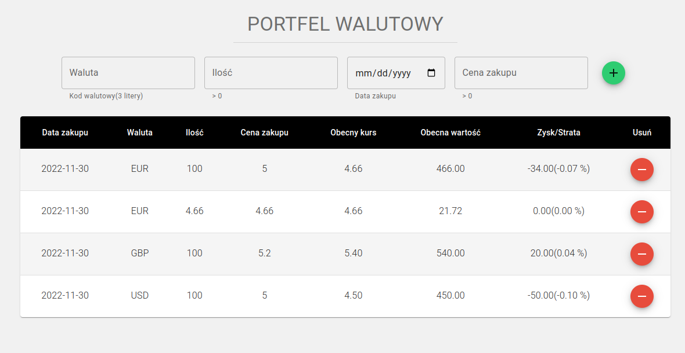

# Currency Wallet

Currency wallet is an application that will calculate the potential profit or loss of currencies. The user will be able to enter detailed information related to the currencies owned. The app adds data to local storage, currency price is getting from [Exchangerates API](https://exchangeratesapi.io/). 
 
[Currency Codes](https://www.iban.pl/currency-codes)

**Main features**:
- React
- Redux
- Material-UI
&nbsp;
 
## 💡 Technologies

&nbsp;
 
## 💿 Installation

The project uses [node](https://nodejs.org/en/) and [npm](https://www.npmjs.com/). 
&nbsp;

To run it locally you should install all dependencies:

    npm i

To run webpack and create a localhost port you should type:

    npm start
    
Runs the app in the development mode.\
Open [http://localhost:3000](http://localhost:3000) to view it in your browser.

The page will reload when you make changes.\
You may also see any lint errors in the console.
&nbsp;

&nbsp;
 
<h1 align="center">Hi , I'm Szymon </h1>
<h4 align="center">I am looking for my first professional experience.</h4>

 <h3>Connect with me:</h3>

 

&nbsp;

## 👏 Thanks / Special thanks / Credits

To  [Akademia Samouka](https://akademiasamouka.pl/) 
